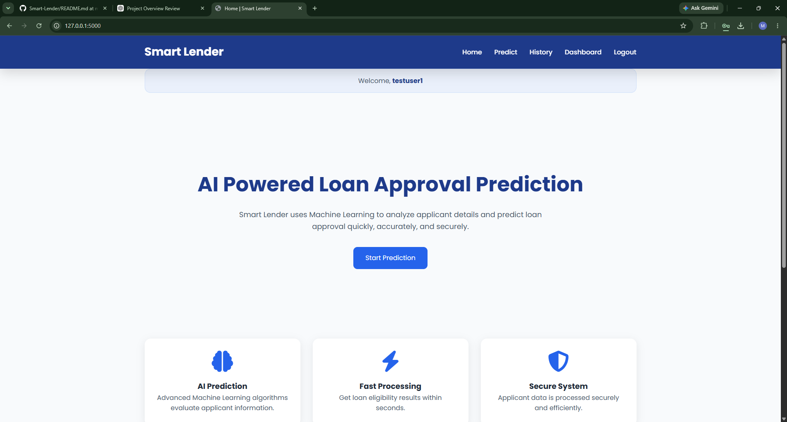
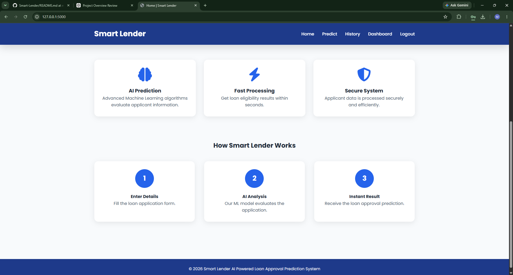
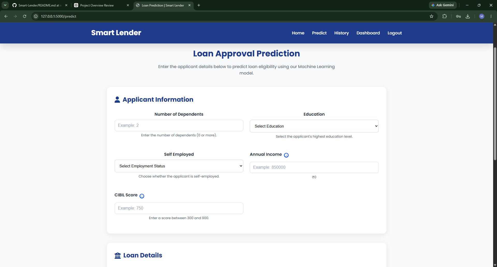
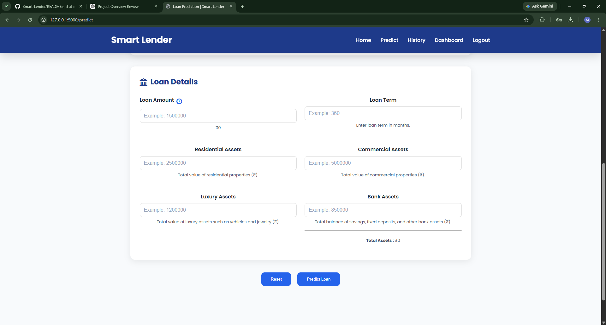
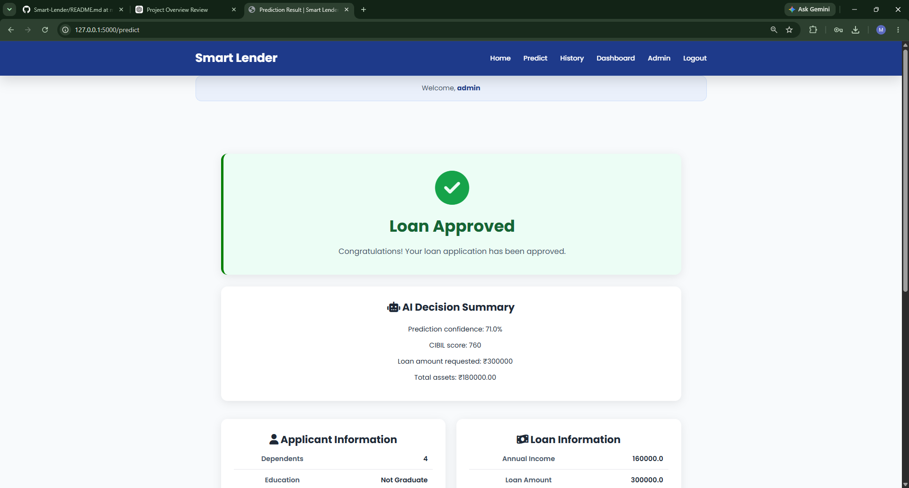
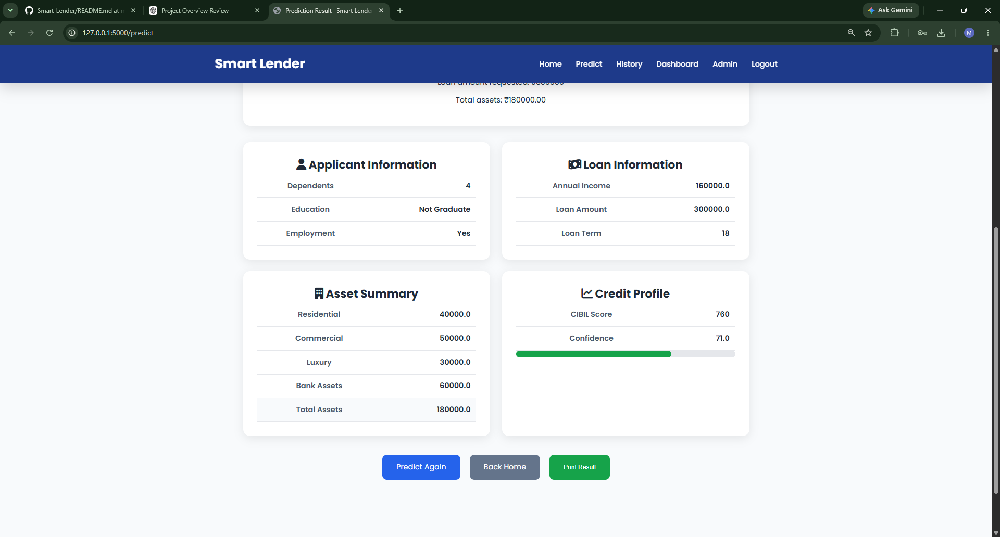
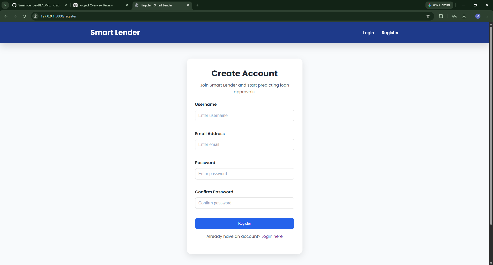
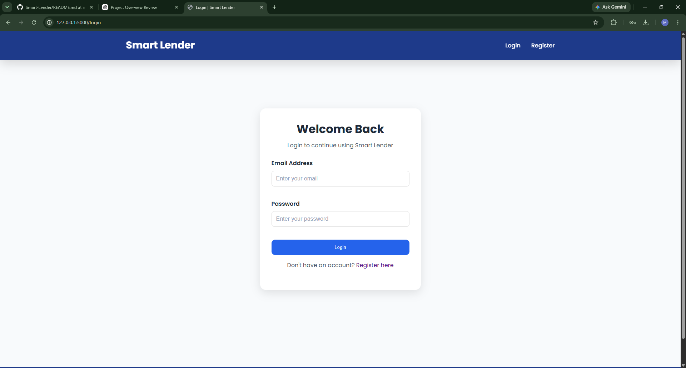
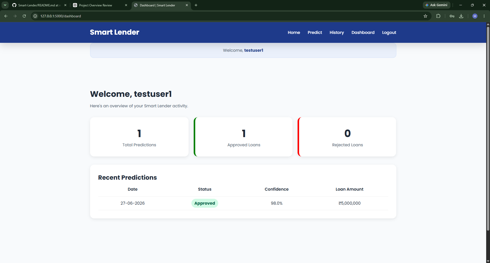
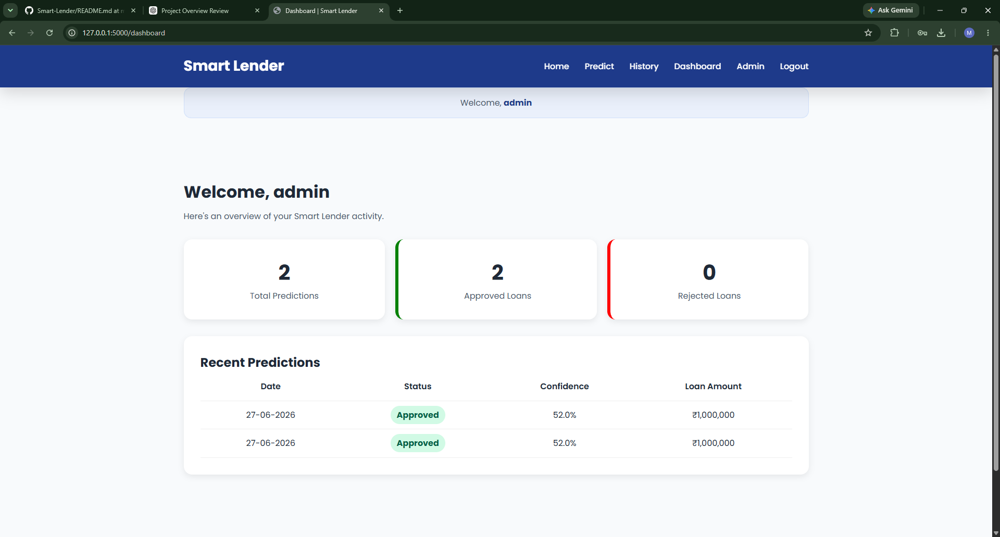

# Smart Lender v1.1

An AI-powered Loan Approval Prediction System built using Machine Learning and Flask.

Smart Lender predicts whether a loan application is likely to be approved or rejected based on applicant financial details and credit history. The application includes authentication, role-based access control, prediction history, and an administrative dashboard.

---

## Features

### Machine Learning

* Loan approval prediction using trained ML model
* Confidence score generation
* Data preprocessing and feature scaling
* Serialized model loading using Pickle

### Authentication

* User Registration
* User Login
* Secure Password Hashing
* Session Management
* Logout Functionality

### Authorization

* Role-Based Access Control (RBAC)
* Customer Role
* Admin Role
* Protected Routes

### Customer Features

* Loan Prediction Form
* Prediction Results Page
* Personal Prediction History
* Customer Dashboard

### Admin Features

* Admin Dashboard
* User Management
* Prediction Monitoring
* System Statistics

### Database

* SQLite Database Integration
* User Storage
* Prediction Storage
* User-Prediction Relationships

---

## Tech Stack

### Backend

* Python
* Flask
* Flask-Login
* Flask-SQLAlchemy
* SQLite

### Machine Learning

* Scikit-Learn
* Pandas
* NumPy
* XGBoost

### Frontend

* HTML5
* CSS3
* JavaScript
* Jinja2 Templates

### Version Control

* Git
* GitHub

---

## Project Structure

```text
Smart-Lender/
│
├── dataset/
├── models/
│   ├── best_model.pkl
│   └── scaler.pkl
│
├── notebooks/
│
├── flask_app/
│   ├── app.py
│   ├── config.py
│   ├── predictor.py
│   ├── extensions.py
│   ├── create_admin.py
│   │
│   ├── models/
│   │   ├── user.py
│   │   └── prediction.py
│   │
│   ├── templates/
│   └── static/
│
├── requirements.txt
└── README.md
```

---

## Installation

### Clone Repository

```bash
git clone <repository-url>
cd Smart-Lender
```

### Create Virtual Environment

```bash
python -m venv venv
```

### Activate Virtual Environment

Windows:

```bash
venv\Scripts\activate
```

Linux / Mac:

```bash
source venv/bin/activate
```

### Install Dependencies

```bash
pip install -r requirements.txt
```

---

## Run Application

```bash
python flask_app/app.py
```

Application URL:

```text
http://127.0.0.1:5000
```

---

## Default Admin Account

Create admin account:

```bash
python flask_app/create_admin.py
```

Default credentials:

```text
Email: admin@smartlender.com
Password: admin123
```

---

## Application Workflow

```text
User Registration
        ↓
User Login
        ↓
Loan Application Input
        ↓
Feature Processing
        ↓
Model Prediction
        ↓
Result Generation
        ↓
Prediction Saved to Database
```

---

## Roles and Permissions

### Customer

* Access Dashboard
* Make Predictions
* View Prediction History
* Logout

### Admin

* Access Admin Dashboard
* View All Users
* View All Predictions
* Monitor System Statistics

---

## Screenshots

## Screenshots

### Home Page





---

### Prediction Form





---

### Result Page





---

### Registration Page



---

### Login Page



---

### User Dashboard



---

### Admin Dashboard



---

## Future Improvements

### v1.2

* Analytics Charts
* Profile Management
* Password Reset
* Search and Filters
* Export Reports

### v2.0

* REST API
* React Frontend
* PostgreSQL
* Docker Deployment
* Cloud Hosting

---

## Author

**CHAMARTHI MANIKANTA**

B.Tech CSM
Raghu Engineering College

---

## License

This project is developed for educational and learning purposes.
